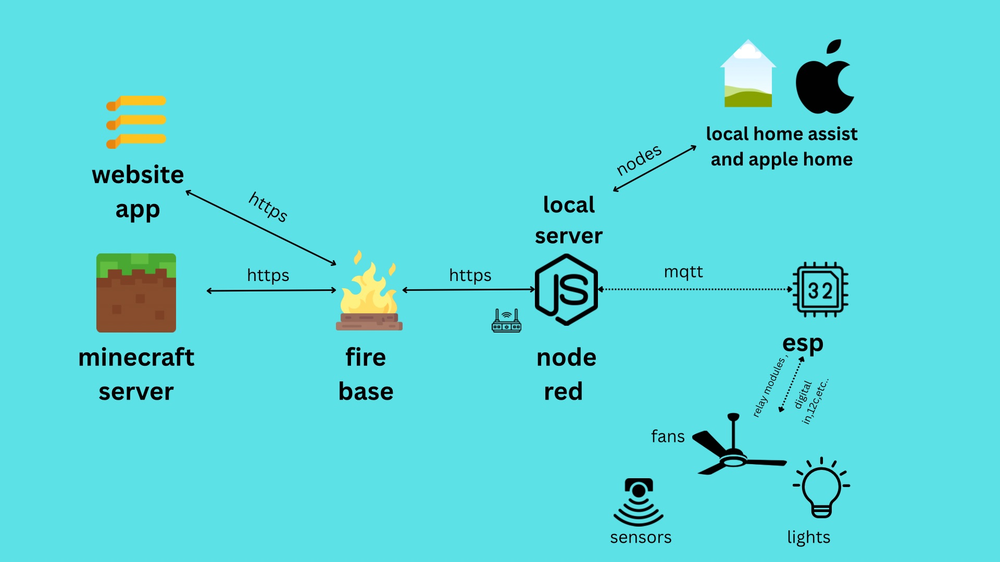

# 🔌 Smart Home Automation & Motion Trigger System  
**ESP32 + Firebase + Node-RED + Minecraft + Apple HomeKit + Reddit API**

A real-world smart automation system using ESP32 microcontroller that bridges the gap between physical devices and virtual platforms like Minecraft, Apple Home, and Reddit.
## 🖼️ Project Poster Preview

---

## 🚀 Features

- **Secure Mode Activation**  
  Detects if no mobile device is nearby via Bluetooth and auto-activates security mode.

- **Motion Detection + Light Trigger**  
  Uses PIR sensors to detect human presence and trigger security lighting.

- **Instant Alerts via Telegram**  
  Sends real-time alerts using Telegram Bot API when motion is detected.

- **Minecraft Integration (via Denizen Scripts)**  
  Motion detection triggers in-game events inside a Minecraft server.

- **Reddit API Automation**  
  Automatically posts or interacts with Reddit based on sensor input.

- **Apple HomeKit Control (via Node-RED bridge)**  
  Control physical devices from Apple Home app using Node-RED HomeBridge integration.

- **Real-Time Sync with Firebase Realtime Database**  
  All sensor data and system states are logged and visualized live in Firebase.

---

## 📦 Technologies Used

- ESP32 (Microcontroller)
- C / Arduino IDE / PlatformIO
- Python (APIs, Telegram Bot)
- Node-RED (for logic flow and API integration)
- Firebase Realtime Database
- Minecraft (PaperMC + Denizen plugin)
- Reddit API & Apple HomeKit (via Node-RED)

---

## 🖼️ Demo

🎥 **Project Demo Video** – [Add YouTube or Google Drive link here]  
🧾 **Presentation Poster** – [Link to Canva or PDF]  
🗃️ **GitHub Repo** – Contains full source code, Node-RED flows, diagrams

---

## 🛠️ Getting Started

### Hardware Requirements
- ESP32 board
- PIR Motion Sensor
- Relay module / Lights
- Bluetooth-supported mobile device

### Software Setup
- Upload ESP32 code via Arduino IDE or PlatformIO
- Set up Firebase project & get API credentials
- Import Node-RED flow and configure endpoints
- Install Denizen plugin on Minecraft server
- Setup Telegram Bot API and Reddit API

---

## 📁 Project Structure

